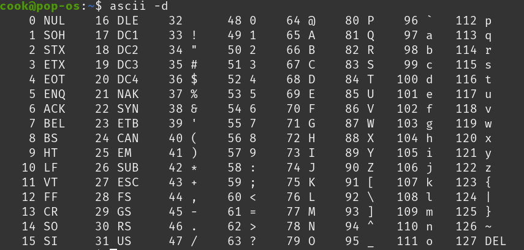

0x04. C - More functions, more nested loops

Learning Objectives

At the end of this project, you are expected to be able to explain to anyone, without the help of Google:
General

    What are nested loops and how to use them
    What is a function and how do you use functions
    What is the difference between a declaration and a definition of a function
    What is a prototype
    Scope of variables
    What are the gcc flags -Wall -Werror -pedantic -Wextra -std=gnu89
    What are header files and how to to use them with #include

Requirements
General

    Allowed editors: vi, vim, emacs
    All your files will be compiled on Ubuntu 20.04 LTS using gcc, using the options -Wall -Werror -Wextra -pedantic -std=gnu89
    All your files should end with a new line
    A README.md file, at the root of the folder of the project is mandatory
    Your code should use the Betty style. It will be checked using betty-style.pl and betty-doc.pl
    You are not allowed to use global variables
    No more than 5 functions per file
    You are not allowed to use the standard library. Any use of functions like printf, puts, etc… is forbidden
    You are allowed to use _putchar
    You don’t have to push _putchar.c, we will use our file. If you do it won’t be taken into account
    In the following examples, the main.c files are shown as examples. You can use them to test your functions, but you don’t have to push them to your repo (if you do we won’t take them into account). We will use our own main.c files at compilation. Our main.c files might be different from the one shown in the examples
    The prototypes of all your functions and the prototype of the function _putchar should be included in your header file called main.h
    Don’t forget to push your header file

0. isupper
mandatory

Write a function that checks for uppercase character.

    Prototype: int _isupper(int c);
    Returns 1 if c is uppercase
    Returns 0 otherwise

FYI: The standard library provides a similar function: isupper. Run man isupper to learn more.

1. isdigit
mandatory

Write a function that checks for a digit (0 through 9).

    Prototype: int _isdigit(int c);
    Returns 1 if c is a digit
    Returns 0 otherwise

FYI: The standard library provides a similar function: isdigit. Run man isdigit to learn more.

2. Collaboration is multiplication
mandatory

Write a function that multiplies two integers.

    Prototype: int mul(int a, int b);

3. The numbers speak for themselves
mandatory

Write a function that prints the numbers, from 0 to 9, followed by a new line.

    Prototype: void print_numbers(void);
    You can only use _putchar twice in your code

4. I believe in numbers and signs
mandatory

Write a function that prints the numbers, from 0 to 9, followed by a new line.

    Prototype: void print_most_numbers(void);
    Do not print 2 and 4

5. Numbers constitute the only universal language
mandatory

Write a function that prints 10 times the numbers, from 0 to 14, followed by a new line.

    Prototype: void more_numbers(void);
    You can only use _putchar three times in your code

6. The shortest distance between two points is a straight line
mandatory

Write a function that draws a straight line in the terminal.

    Prototype: void print_line(int n);
    You can only use _putchar function to print
    Where n is the number of times the character _ should be printed
    The line should end with a \n
    If n is 0 or less, the function should only print \n

7. I feel like I am diagonally parked in a parallel universe
mandatory

Write a function that draws a diagonal line on the terminal.

    Prototype: void print_diagonal(int n);
    You can only use _putchar function to print
    Where n is the number of times the character \ should be printed
    The diagonal should end with a \n
    If n is 0 or less, the function should only print a \n
